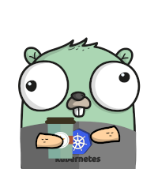

# sanepa

The sane Kubernetes HPA

`sanepa` checks pod resource usage against `deployment.spec.template.spec.containers.resources.limits` values and will scale up and down when a pod is above a set threshold.

This project follows AWS EKS releases, which are well behind Kubernetes releases.

## Versions

I try my best to keep up with AWS EKS, **not** the upstream Kubernetes project.

The `master` branch has tested compatability with Kubernets 1.15.7.

Branches are semver'd to match EKS releases (aside from master, of course).

Because the Kubernetes project moves so quickly, I don't intend on making updates to older SanePA versions once I've released updates for a newer Kubernetes version.

## Running

You can find Kubernetes examples in `examples/k8s/`.

Do **not** run multiple SanePA deployments that watch the same deployment.

SanePA has a very small footprint, so resource consumption shouldn't be a concern.

You can find Docker images [here](https://hub.docker.com/repository/docker/mitchya1/sanepa)

### Notes

`sanepa` runs its checks every 40 seconds. You should take that into consideration when setting `-cooldown` and `-scaledownok` arg values.

If you manually scale a deployment, `sanepa` will not try to scale it back down until it reaches another scaling event.

## Flags

`-incluster`: Defaults to `true`. Set `-incluster=false` to run outside of cluster. Defaults to `true`.

`-ns`: The namespace to check pods and deployments. Defaults to `""`.

`-dep`: The deployment name to check. Set to `none` to skip checking deployments. Defaults to `""`.

`-cpu`: The percentage of the container CPU limit to scale on. If your container has a limit of `100m` and you set this `-cpu=10`, a scaling event will occur when a container hits 10 mCPU. Defaults to 50.

`-mem`: Same idea as CPU. Defaults to 70.

`-max`: The maximum number of replicas in the deployment. Defaults to 5.

`-min`: The minimum number of replicas in the deployment. Defaults to 1.

`-cooldown`: How much time should pass after a scale up event before checking again. If your application takes 90 seconds to start, you should set this to at least 90. Defaults to 30.

`-scaledownok`: How many times must all pods be under thresholds before scaling down. Defaults to 3.

`-scaleupok`: How many times must a pod be above thresholds before scaling up. Defaults to 2.

`-gl-enabled`: Enable logging to Graylog. Defaults to `false`.

`-gl-server`: `IP:PORT` of Graylog server. Defaults to `""`. Required if `-gl-enabled` is `true`.

`-breachpercentthreshold`: Percent of pods that must be breaching a threshold in order to scale. Example: If `-breachpercentthreshold=25`, 25% of pods must be breaching for `scaledownok` periods.

## TODO

- Handle all memory and CPU suffixes
  - Memory details in `kubectl explain PodMetrics.containers.usage`
  